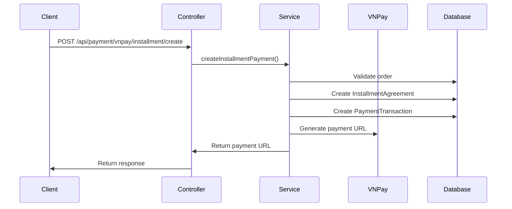
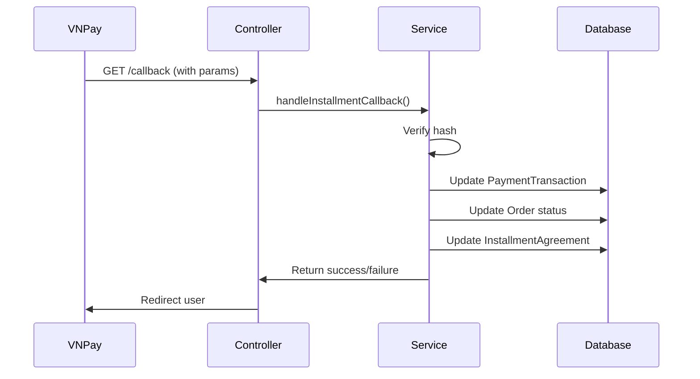

# Hướng dẫn sử dụng VNPay Installment

## Tổng quan

Hệ thống VNPay Installment cho phép khách hàng thanh toán trả góp đơn hàng thông qua VNPay với các kỳ hạn từ 3-24 tháng và lãi suất cạnh tranh.

## Kiến trúc hệ thống

### Các thành phần chính:

1. **VNPayInstallmentService**: Service chính xử lý logic trả góp
2. **VNPayInstallmentController**: REST API endpoints
3. **VNPayInstallmentConfig**: Cấu hình lãi suất và giới hạn
4. **VNPayInstallmentValidator**: Validation logic
5. **VNPayInstallmentCallbackHandler**: Xử lý callback từ VNPay

### Database Schema:

- `installment_agreements`: Thông tin hợp đồng trả góp
- `installment_installments`: Chi tiết các kỳ trả góp
- `payment_transaction`: Giao dịch thanh toán

## Cấu hình

### application.properties:

```properties
# VNPay Configuration
vnpay.tmn-code=P8WZY8S4
vnpay.secret-key=AYAZFPB4UZMSBE23W110JC1WPVMG0DOV
vnpay.pay-url=https://sandbox.vnpayment.vn/paymentv2/vpcpay.html
vnpay.return-url=http://localhost:5173/payment-result
vnpay.ipn-url=https://backend-primeshop.onrender.com/api/payment/vnpay/installment/callback

# VNPay Installment Configuration
vnpay.installment.interest-rates.3=8.5
vnpay.installment.interest-rates.6=9.0
vnpay.installment.interest-rates.9=9.5
vnpay.installment.interest-rates.12=10.0
vnpay.installment.interest-rates.18=10.5
vnpay.installment.interest-rates.24=11.0
vnpay.installment.max-installment-months=24
vnpay.installment.min-installment-months=3
vnpay.installment.min-amount=1000000
vnpay.installment.max-amount=50000000
vnpay.installment.payment-timeout-minutes=15
```

## API Endpoints

### 1. Tạo thanh toán trả góp

**POST** `/api/payment/vnpay/installment/create`

**Request Body:**
```json
{
  "orderId": 123,
  "amount": 1000000,
  "installmentMonths": 6,
  "customerName": "Nguyễn Văn A",
  "customerPhone": "0123456789",
  "customerEmail": "customer@example.com",
  "description": "Thanh toán trả góp đơn hàng #123"
}
```

**Response:**
```json
{
  "paymentUrl": "https://sandbox.vnpayment.vn/paymentv2/vpcpay.html?...",
  "transactionId": "1",
  "orderId": "123",
  "totalAmount": 1000000,
  "monthlyPayment": 175000,
  "installmentMonths": 6,
  "interestRate": 9.0,
  "status": "PENDING",
  "createdAt": "2024-01-15T10:30:00",
  "expiresAt": "2024-01-15T10:45:00",
  "message": "Payment URL created successfully"
}
```

### 2. Xử lý callback từ VNPay

**GET** `/api/payment/vnpay/installment/callback`

**Parameters:** (Tự động từ VNPay)
- `vnp_TxnRef`: Mã giao dịch
- `vnp_ResponseCode`: Mã phản hồi (00 = thành công)
- `vnp_TransactionNo`: Mã giao dịch VNPay
- `vnp_SecureHash`: Chữ ký bảo mật

### 3. Lấy thông tin trả góp

**GET** `/api/payment/vnpay/installment/agreement/{orderId}`

**Response:**
```json
{
  "id": 1,
  "orderId": 123,
  "userId": 456,
  "amount": 100000000,
  "months": 6,
  "annualRate": 9.0,
  "status": "ACTIVE",
  "referenceCode": "uuid-string",
  "createdAt": "2024-01-15T10:30:00Z",
  "updatedAt": "2024-01-15T10:35:00Z"
}
```

### 4. Kiểm tra trạng thái thanh toán

**GET** `/api/payment/vnpay/installment/status/{orderId}`

**Response:**
```json
{
  "orderId": 123,
  "status": "ACTIVE",
  "amount": 100000000,
  "months": 6,
  "interestRate": 9.0,
  "createdAt": "2024-01-15T10:30:00Z",
  "updatedAt": "2024-01-15T10:35:00Z"
}
```

## Luồng xử lý

### 1. Tạo thanh toán trả góp:



### 2. Xử lý callback:



## Validation Rules

### 1. Đơn hàng:
- Phải tồn tại
- Trạng thái phải là `CONFIRMED`
- Không bị xóa

### 2. Số tiền:
- Tối thiểu: 1,000,000 VND
- Tối đa: 50,000,000 VND

### 3. Kỳ hạn:
- Tối thiểu: 3 tháng
- Tối đa: 24 tháng

### 4. Lãi suất:
- 3 tháng: 8.5%
- 6 tháng: 9.0%
- 9 tháng: 9.5%
- 12 tháng: 10.0%
- 18 tháng: 10.5%
- 24 tháng: 11.0%

## Error Handling

### Common Error Codes:

- `INVALID_REQUEST`: Request không hợp lệ
- `INVALID_STATE`: Trạng thái đơn hàng không phù hợp
- `INTERNAL_ERROR`: Lỗi hệ thống
- `INVALID_HASH`: Chữ ký VNPay không hợp lệ

### Error Response Format:

```json
{
  "error": "INVALID_REQUEST",
  "message": "Order must be confirmed before creating installment payment"
}
```

## Security Considerations

1. **Hash Verification**: Luôn verify hash từ VNPay
2. **HTTPS**: Sử dụng HTTPS cho tất cả endpoints
3. **Input Validation**: Validate tất cả input parameters
4. **Rate Limiting**: Implement rate limiting cho API
5. **Logging**: Log tất cả giao dịch để audit

## Testing

### Unit Tests:
- `VNPayInstallmentServiceTest`: Test logic service
- `VNPayInstallmentValidatorTest`: Test validation
- `VNPayInstallmentControllerTest`: Test API endpoints

### Integration Tests:
- Test với VNPay sandbox
- Test callback handling
- Test database transactions

## Monitoring & Logging

### Key Metrics:
- Số lượng giao dịch trả góp
- Tỷ lệ thành công/thất bại
- Thời gian xử lý trung bình
- Lỗi thường gặp

### Log Levels:
- `INFO`: Giao dịch thành công
- `WARN`: Giao dịch thất bại
- `ERROR`: Lỗi hệ thống

## Deployment

### Production Checklist:
- [ ] Cấu hình VNPay production credentials
- [ ] Cập nhật return URL và IPN URL
- [ ] Enable SSL/TLS
- [ ] Configure monitoring
- [ ] Test với VNPay production
- [ ] Backup database
- [ ] Document API endpoints

## Troubleshooting

### Common Issues:

1. **Hash verification failed**:
   - Kiểm tra secret key
   - Kiểm tra thứ tự parameters
   - Kiểm tra encoding

2. **Order not found**:
   - Kiểm tra order ID
   - Kiểm tra trạng thái đơn hàng

3. **Invalid installment months**:
   - Kiểm tra cấu hình min/max months
   - Kiểm tra business rules

### Debug Commands:

```bash
# Check logs
tail -f logs/application.log | grep VNPay

# Check database
SELECT * FROM installment_agreements WHERE order_id = 123;
SELECT * FROM payment_transaction WHERE order_id = '123';
```

## Support

Để được hỗ trợ, vui lòng liên hệ:
- Email: support@primeshop.com
- Phone: 1900-xxxx
- Documentation: https://docs.primeshop.com/vnpay-installment
